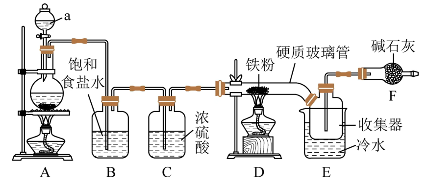

制备 $\ce{FeCl3}$

A：$\ce{MnO2 + 4HCl(浓) \xlongequal{\Delta} MnCl2 +Cl2 ^ +2H2O}$

B（饱和食盐水）：吸收氯化氢气体

C（浓硫酸）：除去氯气中的水分

F（碱石灰）：Ⅰ尾气吸收；Ⅱ防止外界水蒸气进入

E： $\ce{FeCl3}$ 易升华，使用冷水使其变为固体，方便收集

>  $\ce{FeCl3}$ 水解程度较大（$\ce{FeCl3 +3H2O<=>Fe(OH)3 +3HCl}$），因此要注意不能使外界水蒸气进入，同时如果要制备 $\ce{FeCl3}$ 溶液时，应先将 $\ce{FeCl3}$ 固体溶于少量盐酸（使反应逆向移动），再加水稀释
