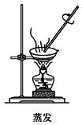

## 加热仪器

### 酒精灯（酒精喷灯）

1. 酒精灯的火焰分为外焰、内焰和焰心，应使用酒精的外焰进行加热
2. 添加酒精时，不超过酒精灯容积的 $2/3$；酒精不少于 $1/4$
3. 绝对禁止向燃着的酒精灯里添加酒精，以免失火
4. 绝对禁止用酒精灯引燃另一只酒精灯
5. 用完酒精灯，必须用灯帽盖灭，不可用嘴去吹
6. 不要碰倒酒精灯，万一洒出的酒精在桌上燃烧起来，应立即用湿布扑灭 

### 石棉网——石棉网是石棉铁丝网的简称

石棉网用于给玻璃仪器加热，石棉的隔热作用，可使受热均匀、缓和

> 注：组装而成的加热装置，见模块化装置中的“反应装置”一节

## 可加热仪器

**A. 可直接加热的仪器：试管、蒸发皿、坩埚、燃烧匙、硬质玻璃管**

| 直接加热的仪器 | 试管                  | 蒸发皿                          | 坩埚                            | 燃烧匙、硬质玻璃管                                           |
| -------------- | --------------------- | ------------------------------- | ------------------------------- | ------------------------------------------------------------ |
| 图片           |  |  |  |   |

注意：可直接加热，但不能骤冷（防止冷热不均炸裂，通常放在石棉网上冷却）

### 试管

1. 加入液体时：不超过试管容积的 $1/2$；若需加热，则不超过 $2/3$
   试管夹：应夹在离试管口 $1/3$ 处（中上部）
2. 加热时：试管外壁应擦干，先均匀受热，再集中加热，不可骤冷骤热，管口不准对着人
   1. 给固体加热时，管口应略向下倾斜。若是粉末，试管口应加棉花。
   2. 给液体加热时，应用酒精灯的外焰（外焰燃烧充分，温度高），并使试管跟桌面成 $45\degree$
3. 振荡试管时，应用拇指、食指、中指握住离试管口的 $1/3$ 处，用腕力振荡试管底部

>    

### 坩埚
耐高温，主要用于固体物质的高温灼烧

1. 相关仪器：配套使用的仪器有：泥三角，三脚架，酒精灯； 取放坩埚时必须使用：坩埚钳；
2. 坩埚的种类：瓷坩埚（常用）、氧化铝坩埚、石英坩埚、铁坩埚
3. 坩埚的选择：原则是不与添加的反应物发生反应； 

> 

### 蒸发皿
液体物质的蒸发、浓缩、结晶（常为瓷质）
1. 液体不超过其容量的 $1/3$ ，边加热边搅拌
2. 若为蒸发结晶：一般当有大量晶体析出时停止加热，靠余热将剩余液体蒸干
3. 若为冷却结晶：一般是加热到表面有晶膜出现时，停止加热，降温结晶，获得晶体

> 

### 燃烧匙
常用于块状或粉末状固体在气体中的燃烧实验（如硫、磷、钠等）
伸入集气瓶作燃烧实验时，应由瓶口慢慢下移，以使反应完全
高温时为防止燃烧匙与反应物反应，可铺一层细沙

**B. 可垫石棉网加热的仪器：烧杯、 锥形瓶、 烧瓶（圆底烧瓶、蒸馏烧瓶 ,三颈烧瓶）**

| 相关仪器 | 烧杯                                                         | 锥形瓶                                                       | 圆底、平底烧瓶                                               | 蒸馏烧瓶                                                     | 三颈烧瓶                                                     |
| -------- | ------------------------------------------------------------ | ------------------------------------------------------------ | ------------------------------------------------------------ | ------------------------------------------------------------ | ------------------------------------------------------------ |
| 图片     | | | | | |
| 特点     | 敞口                                                         | 管口较小                                                     | 有支管口                                                     | “三颈”                                                       | 管口较小                                                     |

注意：加热时需要垫石棉网，液体体积范围为容积的 $[1/3,2/3]$
